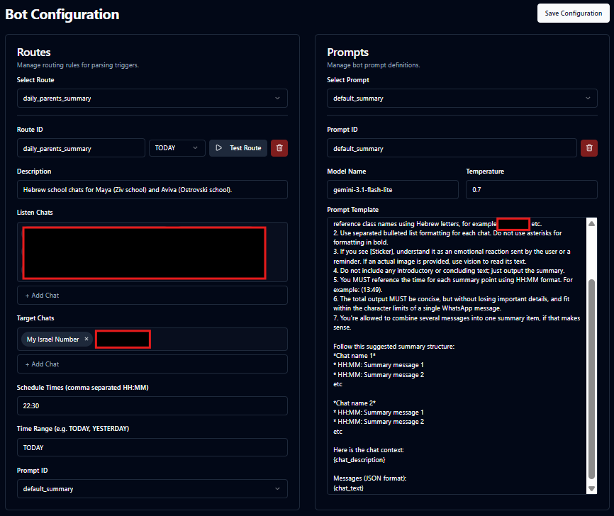
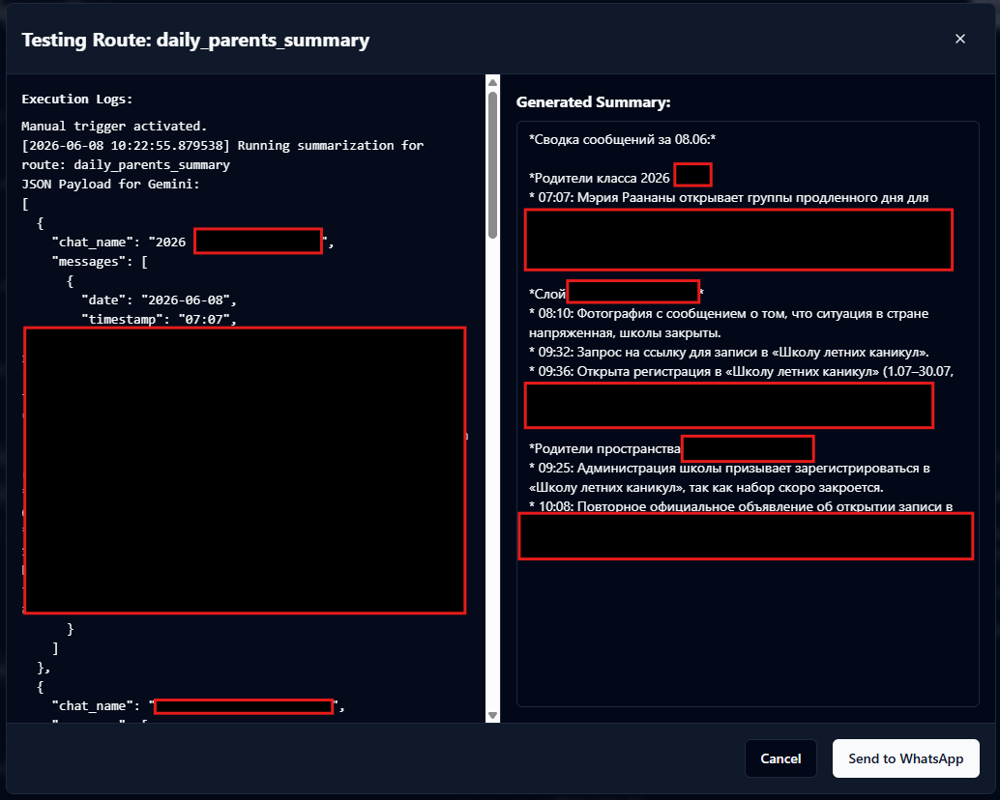

# WhatsApp Summary Bot




## Product Description
The WhatsApp Summary Bot is an intelligent, self-hosted assistant that automatically processes and summarizes your WhatsApp messages using Google GenAI. 

**Privacy & Security:** By deploying this bot on your own private VPS, using your personal WhatsApp account is completely safe. All of your messages, contacts, and media are entirely isolated on your own server, ensuring your data never passes through untrusted third-party services.

## Key Features
*   **AI-Powered Summaries:** Leverage LLM flexibely to quickly digest long conversations.
*   **Total Data Privacy:** 100% self-hosted so your data remains exclusively yours.
*   **Automated Scheduling:** Runs seamlessly in the background with customizable scheduling.
*   **Modern Frontend:** Includes a sleek React/Vite web interface for easy management.

---

## Manual Deployment Guide

This guide provides step-by-step instructions on how to deploy a fresh installation of the WhatsApp Summary Bot on a Linux server.

## Tech Stack
*   **Gateway Backend:** Node.js, Express, `whatsapp-web.js`
*   **Summary Bot Backend:** Python, Google Generative AI (Gemini), SQLite
*   **Frontend Interface:** React 19, TypeScript, Vite, Tailwind CSS, Radix UI

## Prerequisites

Before starting, ensure your system meets the following requirements:
*   **Operating System:** Linux (Ubuntu/Debian recommended).
*   **Hardware (Recommended):** VPS with 2 OCPUs, 2GB RAM, 10GB+ HDD storage.
*   **Git:** To clone the repository.
*   **Docker:** To containerize and run the application.
*   **Docker Compose:** To orchestrate the containers.
*   **Network:** An active internet connection.

*(Note regarding Chromium: The gateway relies on `whatsapp-web.js` which requires Chromium. You do not need to install it on your host machine; it is automatically installed inside the Docker container.)*

## System Configuration

### 1. Install Dependencies
If you haven't installed Docker and Docker Compose, you can do so using the following commands (on Ubuntu/Debian):

```bash
sudo apt update
sudo apt install -y git docker.io docker-compose nodejs npm
sudo systemctl enable --now docker
```


### 2. Clone the Repository
Clone the repository to your server and navigate to the project directory:


```bash
git clone <your-repository-url> bots
cd bots
```

### 3. Setup Docker Network
The application uses an external Docker network named `proxy_network`. You must create this network before starting the containers:

```bash
docker network create proxy_network
```

### 4. Configure the Environment
You need to set up the environment variables and ensure the configuration files are present.

1.  **Environment Variables:** Create a `.env` file in the root directory:
    ```bash
    nano .env
    ```
    Add your required variables. For example:
    ```env
    PORT=8000
    GEMINI_API_KEY=your_gemini_api_key_here
    TZ=Asia/Jerusalem
    ```

2.  **Configuration:** Copy the provided example configuration file and edit it to fit your specific use cases (add your actual chat IDs and schedule):
    ```bash
    cp config.example.yaml config.yaml
    nano config.yaml
    ```

### 5. Create Required Files and Directories
Docker volumes require certain files and directories to exist on the host before starting. If they do not exist, Docker might incorrectly create files as directories.

Run the following commands to scaffold the required structure:

```bash
# Create the SQLite database file
touch messages.db

# Create directories for media and WhatsApp authentication
mkdir -p media
mkdir -p .wwebjs_auth

# Setup dashboard password file (required by the gateway volume mapping)
mkdir -p ../dashboard
touch ../dashboard/.htpasswd
```

### 6. Start the Application
Build and start the application using Docker Compose:

```bash
docker-compose up -d --build
```
This command starts the `whatsapp_gateway` (Node.js backend), `summary_bot` (Python worker), and the `frontend` web interface. The frontend will be accessible on your host machine at port `8080`.

### 7. Link WhatsApp Account
After the containers start, you need to link the bot to a WhatsApp account. Check the gateway logs to view the QR code:

```bash
docker logs -f whatsapp_gateway
```
Scan the QR code displayed in the terminal using your WhatsApp app (Linked Devices -> Link a Device). Once scanned, the session is saved in the `.wwebjs_auth` folder and persists across restarts.

### 8. Configure Cron for Container Restarts
To ensure stability, set up a cron job to restart the containers every 8 hours.

Open your crontab editor:
```bash
crontab -e
```
Add the following line to the end of the file:
```bash
0 */8 * * * cd /path/to/bots && docker-compose restart
```
*(Make sure to replace `/path/to/bots` with the absolute path to your cloned directory).*


